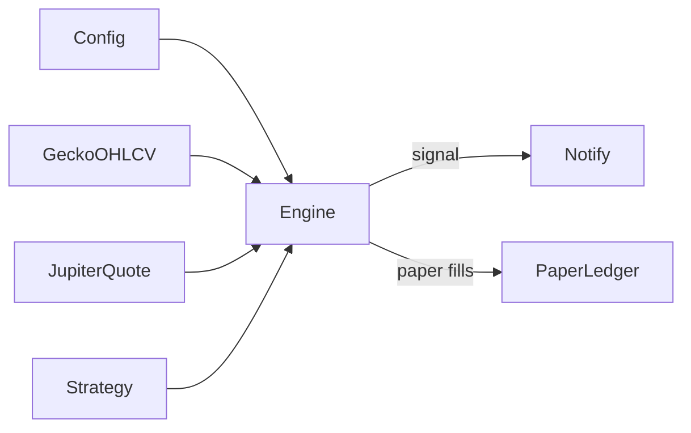

# Plans

## v1 — Solana Jupiter Speculator (simplified)

**Status:** implementing  
**Stack:** Node ≥24 (24 Active LTS recommended), pnpm, TypeScript, Jupiter Swap quote API, GeckoTerminal OHLCV

### Goal

CLI bot that:

1. Fetches OHLCV candles and a spot quote for configured mints.
2. Computes lightweight EMA/RSI indicators and prints `BUY` / `SELL` / `HOLD`.
3. In **paper** mode, maintains a virtual portfolio and P&L using Jupiter quotes as simulated fill prices.

**Out of scope for v1:** backtest, Executor / dry-run / live swaps, `TradeIntent`, shorts.

### Why GeckoTerminal (even without backtest)

EMA/RSI need a series of closes. Jupiter only returns a spot swap quote, not candle history. GeckoTerminal supplies OHLCV; Jupiter supplies the paper fill price.

### Architecture



| Layer | Role |
|-------|------|
| GeckoTerminal | OHLCV for the strategy |
| JupiterClient | Spot quote for paper fills |
| Strategy | EMA/RSI → Signal |
| Engine | Poll loop: data → signal → notify / paper |
| PaperLedger | Virtual cash/position and P&L; persisted to `paper-state.json` |
| Notify | Console + JSONL; optional Telegram (BUY/SELL + paper fills via grammY) |

### Strategy (EMA crossover + RSI filter)

| Mode | Timeframe | EMA fast/slow | RSI |
|------|-----------|---------------|-----|
| `intraday` | `15m` | 9 / 21 | 14; BUY if RSI &lt; 70, SELL if RSI &gt; 30 |
| `swing` | `4h` | 12 / 26 | same RSI filters |

- **BUY** — fast EMA crosses above slow + RSI in range  
- **SELL** — fast EMA crosses below slow + RSI in range  
- **HOLD** — otherwise  
- One virtual long per pair: flat → long → flat (no short)

Default pair: `SOL/USDC`.

### CLI

```bash
pnpm watch   # signal recommendations only
pnpm paper   # signals + virtual portfolio
```

### Config (`.env`)

```
MODE=signal          # signal | paper
STRATEGY=intraday    # intraday | swing
JUPITER_API_KEY=
WATCHLIST=SOL/USDC
POLL_INTERVAL_MS=60000
PAPER_CASH_USDC=1000   # seeds paper portfolio when paper-state.json is absent
GECKO_POOL_ADDRESS=  # optional explicit Solana pool
TELEGRAM_BOT_TOKEN=  # optional; with CHAT_ID enables Telegram alerts
TELEGRAM_CHAT_ID=
```

Paper portfolio state (cash, open position, realized P&L, trades) is saved to `paper-state.json` after each fill and restored on restart. Delete that file to reset to `PAPER_CASH_USDC`.

### Risks

- Free OHLCV may rate-limit — backoff + in-memory cache.
- Paper fills ignore real slippage/MEV — mark as simulated.
- Jupiter API key recommended for stable quotes on `api.jup.ag`.
